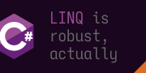
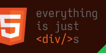
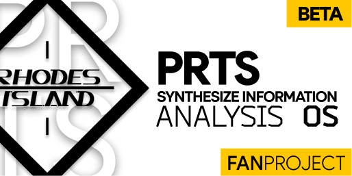
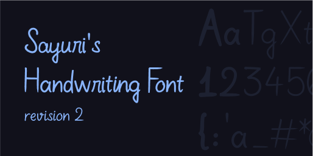
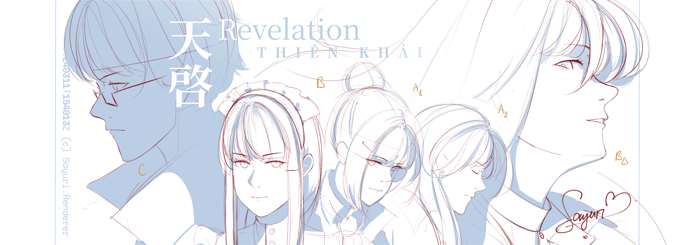
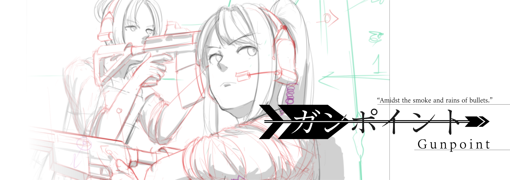

  
  <i style="align-self: flex-end;">"Have an idea? Let's put it to motion."</i>

#
### Greetings!

I'm Sayuri, currently a [Computer Science] student.

I take joy in making graphical user interfaces and adding a touch of motion into them.

To me, anything interface is a work of art in and of itself -
each deserves care and attention in order to become
something special.

#

### Commonly-used tools

  
  
  
  
  
  

### Technologies used recently

  

    

      <i>Basic understanding</i>
      <i>Have some grasp in features</i>
      <i>Usually tech of choice</i>
    

    

  

  

    

      
    

    

      
      
    

    

      
      
      
    

    

      
      
      
      
    

  

#

### Projects

  
  
  
  

#

### Art
You can find more on <a href="https://www.pixiv.net/en/users/24697420">my Pixiv (UID `24697420`)</a>, but I don't upload WIPs. And I have lots of WIPs (lmao)

  
  
  

